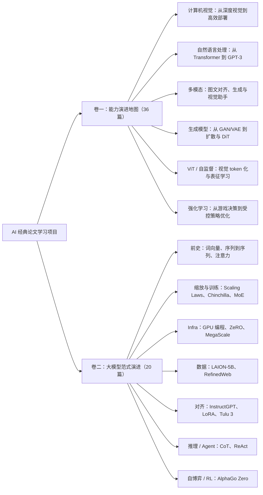

# 阅读地图

这份地图解决一个问题：读者不必从 56 篇论文里随机开始，而是可以按层级逐步进入。

## 三层结构

如果站点环境没有渲染 Mermaid，可直接按下面的文字路径阅读。

## 项目层：先选阅读视角

| 视角 | 适合谁 | 解决的问题 | 入口 |
|---|---|---|---|
| 卷一：能力演进地图 | 想建立 AI 全局能力地图的人 | AI 能做什么，能力边界如何被改写 | [卷一目录](catalog.md) |
| 卷二：大模型范式演进 | 正在做 LLM / Agent / 基础模型产品的人 | 大模型如何被训练、对齐、部署和接入产品 | [卷二目录](season-2.md) |

## 分组层：每组先抓主线

### 卷一分组

| 分组 | 主线问题 | 建议先读 |
|---|---|---|
| 计算机视觉 | 机器如何从手工特征走向端到端视觉表征 | [AlexNet](../notes/computer-vision/01-alexnet.md)、[ResNet](../notes/computer-vision/04-resnet.md)、[YOLO](../notes/computer-vision/08-yolo.md) |
| 自然语言处理 | 语言模型如何从序列建模走向通用预训练与少样本能力 | [Transformer](../notes/nlp/11-transformer.md)、[BERT](../notes/nlp/12-bert.md)、[GPT-3](../notes/nlp/17-gpt-3.md) |
| 多模态与视觉语言 | 图像和语言如何进入同一能力空间 | [CLIP](../notes/multimodal/18-clip.md)、[Flamingo](../notes/multimodal/21-flamingo.md)、[LLaVA](../notes/multimodal/22-llava.md) |
| 生成模型与扩散 | 生成能力如何从对抗训练走向可控高质量生成 | [GAN](../notes/generative-models/24-gan.md)、[DDPM](../notes/generative-models/27-ddpm.md)、[Stable Diffusion](../notes/generative-models/28-stable-diffusion.md) |
| ViT / 自监督 | 视觉如何被 token 化，表征如何从标签监督走向自监督 | [ViT](../notes/vision-transformer-self-supervised/30-vit.md)、[SimCLR](../notes/vision-transformer-self-supervised/32-simclr.md)、[MoCo](../notes/vision-transformer-self-supervised/33-moco.md) |
| 强化学习 | 决策系统如何从感知输入走向长期回报优化 | [DQN](../notes/reinforcement-learning/34-dqn.md)、[AlphaGo](../notes/reinforcement-learning/35-alphago.md)、[PPO](../notes/reinforcement-learning/36-ppo.md) |

### 卷二分组

| 分组 | 主线问题 | 建议先读 |
|---|---|---|
| 序列建模前史 | Transformer 之前，语言表示和序列建模解决了什么 | [Word2Vec](../notes/season-2/foundations/s01-word2vec.md)、[Attention](../notes/season-2/foundations/s03-attention-nmt.md) |
| 缩放与训练范式 | 模型能力为什么越来越依赖规模、数据和计算配比 | [The Bitter Lesson](../notes/season-2/scaling-training/s05-bitter-lesson.md)、[Scaling Laws](../notes/season-2/scaling-training/s06-scaling-laws.md)、[Chinchilla](../notes/season-2/scaling-training/s07-chinchilla.md) |
| 训练基础设施 | 为什么大模型训练首先是工程系统问题 | [ZeRO](../notes/season-2/infrastructure/s11-zero.md)、[MegaScale](../notes/season-2/infrastructure/s12-megascale.md) |
| 数据集与数据治理 | 数据规模、质量、过滤和版权如何影响模型边界 | [LAION-5B](../notes/season-2/data/s13-laion-5b.md)、[RefinedWeb](../notes/season-2/data/s14-refinedweb.md) |
| 后训练与对齐 | 通用模型如何变成可交互、可控、可适配的产品能力 | [InstructGPT](../notes/season-2/post-training-alignment/s15-instructgpt.md)、[LoRA](../notes/season-2/post-training-alignment/s16-lora.md) |
| 推理与 Agent | 模型如何从回答问题走向分步推理和工具使用 | [Chain-of-Thought](../notes/season-2/reasoning-agents/s18-chain-of-thought.md)、[ReAct](../notes/season-2/reasoning-agents/s19-react.md) |
| 自博弈与强化学习 | 当系统能从自我对局中产生数据时，能力边界如何变化 | [AlphaGo Zero](../notes/season-2/self-play-rl/s20-alphago-zero.md) |

## 单篇层：每篇笔记的阅读对象

每篇论文笔记都可以看成一张“学习卡”：

| 模块 | 读者要拿走什么 |
|---|---|
| 一句话 | 这篇论文的最小可复述版本 |
| 背景问题 | 当时卡住了什么，为什么这篇论文值得出现 |
| 核心方法 | 机制、结构或训练范式的关键变化 |
| 为什么经典 | 它改写了哪些能力边界 |
| PM 启发 | 今天做产品时应该形成什么判断力 |
| 局限与争议 | 哪些能力不能误归因，哪些条件至今有效 |
| 理解检查 | 是否能离开原文，用自己的话解释 |

## 可视化内容规划

当前优先维护 Markdown 内的轻量可视化，避免图片资产和目录不同步：

1. 项目层：两卷关系图，说明横切能力与纵切生命周期。
2. 分组层：每组的主线问题、代表论文、建议先读路径。
3. 单篇层：固定“学习卡”结构，让读者知道每篇该提取什么。

后续如果要继续增强视觉体验，可以追加三类资产：

| 层级 | 可视化形式 | 用途 | 维护成本 |
|---|---|---|---|
| 项目 | 一张总览架构图 | 新读者 30 秒理解两卷关系 | 低 |
| 分组 | 每组一张时间线或能力地图 | 做 NotebookLM slides 或文章导读 | 中 |
| 单篇 | 论文学习卡片或机制小图 | 分享单篇笔记、做社媒图或课程讲义 | 高 |

优先级建议：先做项目总览图，再做每组时间线，最后再做单篇卡片。单篇图最精致，但也最容易随正文修改而失配。
